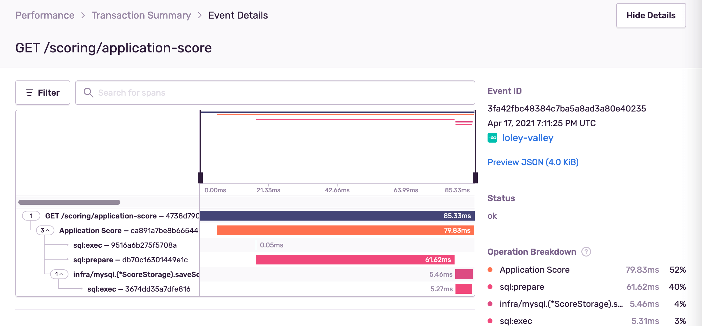

# ocsentry

[](https://github.com/vearutop/ocsentry/actions?query=branch%3Amaster+workflow%3Atest-unit)
[](https://codecov.io/gh/vearutop/ocsentry)
[](https://pkg.go.dev/github.com/vearutop/ocsentry)
[](https://wakatime.com/badge/github/vearutop/ocsentry)


Provides [OpenCensus](https://github.com/opencensus-integrations) traces support for [Sentry](https://sentry.io/).



## Why?

OpenCensus has tracing instrumentations for a variety of technologies (databases, services, caches, etc...), this
library enables those instrumentations for Sentry performance tools with minimal effort.

Also implementing traces with Sentry client directly makes it harder to change the technology in the future, as opposed
to vendor-unlocked OpenCensus.

## Usage

* Replace default tracer with a wrapper: `trace.DefaultTracer = ocsentry.WrapTracer(trace.DefaultTracer)`.
* Use `ocsentry.HTTPHandlerMiddleware` instead
  of [`github.com/getsentry/sentry-go/http.(*Handler).Handle`](https://pkg.go.dev/github.com/getsentry/sentry-go/http#Handler.Handle)
  so that original `sentry` tracer does not duplicate the `ochttp` job.

```go
package main

import (
	"log"
	"net/http"
	"time"

	"github.com/getsentry/sentry-go"
	"github.com/vearutop/ocsentry"
	"go.opencensus.io/plugin/ochttp"
	"go.opencensus.io/trace"
)

func main() {
	// Initialize Sentry.
	err := sentry.Init(sentry.ClientOptions{
		Dsn:        "https://abc123abc123abc123abc123@o123456.ingest.sentry.io/1234567",
		ServerName: "my-service",
		Release:    "v1.2.3",
	})
	if err != nil {
		log.Fatal(err)
	}

	defer func() {
		sentry.Flush(time.Second)
	}()

	// Setup OC sampling.
	trace.ApplyConfig(trace.Config{
		DefaultSampler: trace.ProbabilitySampler(0.01),
	})

	// Enable Sentry wrapper.
	trace.DefaultTracer = ocsentry.WrapTracer(trace.DefaultTracer)

	var h http.Handler = http.HandlerFunc(func(w http.ResponseWriter, r *http.Request) {
		_, err := w.Write([]byte("Hello, world!"))
		if err != nil {
			log.Print(err)

			return
		}
	})

	// Apply OpenCensus middleware and Sentry middlewares to your http.Handler.
	h = ocsentry.HTTPHandlerMiddleware(h)
	h = &ochttp.Handler{Handler: h}

	if err := http.ListenAndServe(":80", h); err != nil {
		log.Print(err)

		return
	}
}

```